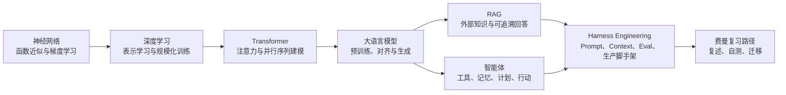

# AI Foundations Feynman Textbook Implementation Plan

> **For agentic workers:** REQUIRED SUB-SKILL: Use superpowers:subagent-driven-development (recommended) or superpowers:executing-plans to implement this plan task-by-task. Steps use checkbox (`- [ ]`) syntax for tracking.

**Goal:** Build a Chinese long-form Markdown textbook and companion visual-aid notes that teach modern AI foundations through the Feynman learning method.

**Architecture:** The main textbook is a single coherent narrative document. Companion notes are split by chapter under `notes/visual-aids/`, each focused on diagrams, comparison tables, image-generation prompts, and external figure references. The design spec remains the source of truth for scope and acceptance criteria.

**Tech Stack:** Markdown, Mermaid diagrams, ASCII diagrams, Git, PowerShell, optional web research against primary sources and official documentation during execution.

---

## Scope Check

The spec covers one documentation product rather than multiple independent software subsystems. The chapters are conceptually distinct but depend on a shared narrative path from neural networks to production AI systems, so this should stay as one implementation plan with chapter-level tasks.

## File Structure

- Create: `AI基础费曼学习法教材.md`
  - Responsibility: the complete textbook, written in Chinese, readable from start to finish without opening the companion notes.
- Create: `notes/visual-aids/01-neural-networks.md`
  - Responsibility: diagrams and visual notes for neural networks, loss, gradients, and backpropagation.
- Create: `notes/visual-aids/02-deep-learning.md`
  - Responsibility: diagrams and visual notes for representation learning, training loops, fitting behavior, and model families.
- Create: `notes/visual-aids/03-transformer-attention.md`
  - Responsibility: diagrams and visual notes for Q/K/V attention, multi-head attention, Transformer blocks, positional information, and masks.
- Create: `notes/visual-aids/04-large-language-models.md`
  - Responsibility: diagrams and visual notes for tokenization, pretraining, alignment, generation, and model trade-offs.
- Create: `notes/visual-aids/05-rag.md`
  - Responsibility: diagrams and visual notes for retrieval augmented generation pipelines, chunking, embeddings, reranking, and RAG evaluation.
- Create: `notes/visual-aids/06-agents.md`
  - Responsibility: diagrams and visual notes for agent loops, ReAct, workflow versus agent boundaries, tool calling, and multi-agent trade-offs.
- Create: `notes/visual-aids/07-harness-engineering.md`
  - Responsibility: diagrams and visual notes for Prompt Engineering, Context Engineering, Evaluation Harness, and production AI application scaffolding.
- Create: `notes/visual-aids/08-feynman-review-path.md`
  - Responsibility: diagrams and visual notes for the study path, concept dependency graph, self-test checklist, and explanation rubrics.
- Modify: `docs/superpowers/specs/2026-05-03-ai-foundations-feynman-design.md`
  - Responsibility: no content edits expected. Read it before each phase to verify scope.

## Source Ground Rules

- Use primary sources or official sources when checking facts about named papers, model training workflows, RAG, tool calling, evals, and agent engineering.
- For fast-changing engineering practices, write with time context instead of making permanent claims.
- Do not copy protected textbook or course images into the repository. Use self-drawn Mermaid/ASCII diagrams, generated-image prompts, and short external figure references.
- Use concise citations in the textbook when a specific paper or official source materially anchors a concept.

---

### Task 1: Scaffold Main Textbook and Visual Notes

**Files:**
- Create: `AI基础费曼学习法教材.md`
- Create: `notes/visual-aids/01-neural-networks.md`
- Create: `notes/visual-aids/02-deep-learning.md`
- Create: `notes/visual-aids/03-transformer-attention.md`
- Create: `notes/visual-aids/04-large-language-models.md`
- Create: `notes/visual-aids/05-rag.md`
- Create: `notes/visual-aids/06-agents.md`
- Create: `notes/visual-aids/07-harness-engineering.md`
- Create: `notes/visual-aids/08-feynman-review-path.md`

- [ ] **Step 1: Create the main textbook shell**

Create `AI基础费曼学习法教材.md` with this exact top-level structure:

```markdown
# AI 技术基础：费曼学习法教材

## 如何使用这份教材

## 全书知识地图

## 第 1 章：从函数近似器理解神经网络

## 第 2 章：深度学习为什么“深”

## 第 3 章：Transformer 与注意力机制

## 第 4 章：大语言模型

## 第 5 章：RAG：让模型带着资料回答

## 第 6 章：智能体：把模型放进行动循环

## 第 7 章：Harness Engineering：从会调用模型到构建可靠系统

## 第 8 章：费曼复习路径

## 参考资料与延伸阅读
```

- [ ] **Step 2: Add a reusable chapter template to the main textbook**

Under each numbered chapter heading, add the following level-3 sections in this order:

```markdown
### 一句话解释

### 为什么需要它

### 先用直觉理解

### 用大学数学重新看一遍

### 工程视角：它在真实系统里做什么

### 常见误区

### 费曼自测

### 本章小结
```

For Chapter 8, use this adjusted structure:

```markdown
### 一句话解释

### 如何用费曼学习法复习 AI

### 概念依赖关系

### 三层复述法

### 自测清单

### 下一步学习路线

### 本章小结
```

- [ ] **Step 3: Create visual note shells**

Create each file under `notes/visual-aids/` with this structure:

```markdown
# Chapter Visual Notes

## 核心图示

## Mermaid 图

## ASCII / 小型机制图

## 对照表

## 生成图片提示词

## 外部图参考

## 速记卡片
```

Replace `Chapter Visual Notes` with the chapter-specific Chinese title from the main textbook.

- [ ] **Step 4: Verify scaffold headings exist**

Run:

```powershell
rg -n "^## |^### " "AI基础费曼学习法教材.md" "notes/visual-aids"
```

Expected: the command lists all main chapter headings and all visual-note section headings.

- [ ] **Step 5: Commit the scaffold**

Run:

```powershell
git add -- "AI基础费曼学习法教材.md" "notes/visual-aids"
git commit -m "docs: scaffold AI foundations textbook"
```

Expected: commit succeeds and includes the main textbook plus eight visual note files.

---

### Task 2: Write the Reader Guide and Knowledge Map

**Files:**
- Modify: `AI基础费曼学习法教材.md`
- Modify: `notes/visual-aids/08-feynman-review-path.md`

- [ ] **Step 1: Fill `如何使用这份教材`**

Write this section with four paragraphs:

1. Explain that the book uses the Feynman method: define simply, explain why, rebuild with math, test by teaching back.
2. Explain the assumed background: college math, basic Python reading ability, no deep learning prerequisite.
3. Explain the A+B reading mode: intuitive layer first, mathematical and engineering layer second.
4. Explain how to use visual notes: open them when diagrams, tables, and prompts make the Markdown text easier to reason about.

- [ ] **Step 2: Fill `全书知识地图`**

Add a short introductory paragraph and this Mermaid graph:

```markdown

```

- [ ] **Step 3: Add the first visual route map**

In `notes/visual-aids/08-feynman-review-path.md`, add a matching `Mermaid 图` section with the same knowledge graph and a `速记卡片` table:

```markdown
| 阶段 | 你应该能说清楚什么 | 卡住时回到哪里 |
|---|---|---|
| 神经网络 | 模型如何把输入变成输出，损失如何推动参数更新 | 权重、偏置、激活函数、梯度下降 |
| Transformer | 一个 token 如何选择要关注的上下文 | Q/K/V、softmax、多头注意力、位置编码 |
| LLM | 为什么预测下一个 token 能形成语言能力 | tokenization、预训练、指令微调、对齐 |
| RAG | 为什么检索能降低知识过期和幻觉风险 | chunk、embedding、召回、重排、引用 |
| 智能体 | 模型如何从回答问题变成执行任务 | 工具调用、记忆、规划、观察反馈 |
| Harness | 如何让 AI 应用可测、可控、可观测 | prompt、context、eval、日志、权限 |
```

- [ ] **Step 4: Verify knowledge map renders as Markdown text**

Run:

```powershell
rg -n "flowchart LR|神经网络|Harness Engineering|费曼复习路径" "AI基础费曼学习法教材.md" "notes/visual-aids/08-feynman-review-path.md"
```

Expected: both files contain the knowledge-map terms.

- [ ] **Step 5: Commit reader guide**

Run:

```powershell
git add -- "AI基础费曼学习法教材.md" "notes/visual-aids/08-feynman-review-path.md"
git commit -m "docs: add reader guide and knowledge map"
```

Expected: commit succeeds.

---

### Task 3: Write Chapter 1, Neural Networks

**Files:**
- Modify: `AI基础费曼学习法教材.md`
- Modify: `notes/visual-aids/01-neural-networks.md`

- [ ] **Step 1: Fill Chapter 1 concept narrative**

Under `第 1 章：从函数近似器理解神经网络`, write sections that cover these exact claims:

- A neural network can be understood as a parameterized function `f(x; θ)`.
- A neuron computes a weighted sum plus bias, then passes it through an activation function.
- Stacking only linear layers without activation still gives one linear transformation.
- Loss functions turn model error into a scalar objective.
- Gradient descent updates parameters by moving opposite the loss gradient.
- Backpropagation is efficient chain-rule bookkeeping on a computation graph.

- [ ] **Step 2: Add the math layer**

Include these formulas with explanatory text:

```markdown
z = w^\top x + b

a = \sigma(z)

\hat{y} = f(x; \theta)

L(\theta) = \frac{1}{n}\sum_{i=1}^{n} \ell(f(x_i;\theta), y_i)

\theta_{t+1} = \theta_t - \eta \nabla_\theta L(\theta_t)
```

Explain every symbol in plain Chinese immediately after the formulas.

- [ ] **Step 3: Add Chapter 1 Feynman self-tests**

Add at least these questions under `费曼自测`:

```markdown
1. 如果神经网络只是一个函数，为什么它还需要训练？
2. 为什么没有激活函数的多层网络本质上仍然是线性的？
3. 损失函数和准确率有什么区别？
4. 梯度下降为什么不保证一次走到全局最优？
5. 反向传播到底在复用什么计算？
```

- [ ] **Step 4: Fill visual notes for Chapter 1**

In `notes/visual-aids/01-neural-networks.md`, add:

- A Mermaid flowchart showing `输入 -> 线性变换 -> 激活函数 -> 输出 -> 损失 -> 梯度 -> 参数更新`.
- An ASCII diagram showing one neuron with `x1, x2, x3`, weights, bias, activation, and output.
- A table comparing `参数`, `激活`, `损失`, `梯度`, `学习率`.
- A generated-image prompt for a clean educational diagram of gradient descent on a bowl-shaped loss surface.

- [ ] **Step 5: Verify Chapter 1 coverage**

Run:

```powershell
rg -n "f\\(x; θ\\)|激活函数|损失函数|梯度下降|反向传播|链式法则" "AI基础费曼学习法教材.md" "notes/visual-aids/01-neural-networks.md"
```

Expected: all terms appear in the main textbook or visual notes.

- [ ] **Step 6: Commit Chapter 1**

Run:

```powershell
git add -- "AI基础费曼学习法教材.md" "notes/visual-aids/01-neural-networks.md"
git commit -m "docs: write neural networks chapter"
```

Expected: commit succeeds.

---

### Task 4: Write Chapter 2, Deep Learning

**Files:**
- Modify: `AI基础费曼学习法教材.md`
- Modify: `notes/visual-aids/02-deep-learning.md`

- [ ] **Step 1: Fill Chapter 2 narrative**

Under `第 2 章：深度学习为什么“深”`, write sections that cover:

- Deep learning learns representations rather than relying only on handcrafted features.
- Early layers tend to capture local/simple patterns; deeper layers combine them into more abstract features.
- Depth increases expressive power but also increases optimization and generalization challenges.
- Overfitting means the model learned training-set details that do not transfer well.
- Regularization, normalization, data augmentation, and better optimizers reduce training difficulty.
- CNNs, RNNs, and Transformers are different inductive biases for different data structures and computational constraints.

- [ ] **Step 2: Add training-loop intuition**

Include this pseudocode block and explain each line:

```python
for epoch in range(num_epochs):
    for x_batch, y_batch in dataloader:
        y_pred = model(x_batch)
        loss = loss_fn(y_pred, y_batch)
        loss.backward()
        optimizer.step()
        optimizer.zero_grad()
```

- [ ] **Step 3: Add fitting behavior self-tests**

Under `费曼自测`, add at least:

```markdown
1. 为什么“深”不只是层数更多，而是表示方式发生了变化？
2. 欠拟合和过拟合分别说明模型出了什么问题？
3. 为什么训练误差下降不一定意味着模型更有用？
4. batch、epoch、learning rate 分别控制训练过程中的什么？
5. CNN、RNN、Transformer 的核心偏置各是什么？
```

- [ ] **Step 4: Fill visual notes for Chapter 2**

In `notes/visual-aids/02-deep-learning.md`, add:

- A table comparing manual feature engineering and representation learning.
- A Mermaid training loop diagram.
- An ASCII sketch of underfit, fit, and overfit curves.
- A table comparing CNN, RNN, and Transformer by data assumption, strength, weakness, and historical role.

- [ ] **Step 5: Verify Chapter 2 coverage**

Run:

```powershell
rg -n "表示学习|过拟合|欠拟合|正则化|batch|epoch|CNN|RNN|Transformer" "AI基础费曼学习法教材.md" "notes/visual-aids/02-deep-learning.md"
```

Expected: all key terms appear.

- [ ] **Step 6: Commit Chapter 2**

Run:

```powershell
git add -- "AI基础费曼学习法教材.md" "notes/visual-aids/02-deep-learning.md"
git commit -m "docs: write deep learning chapter"
```

Expected: commit succeeds.

---

### Task 5: Write Chapter 3, Transformer and Attention

**Files:**
- Modify: `AI基础费曼学习法教材.md`
- Modify: `notes/visual-aids/03-transformer-attention.md`

- [ ] **Step 1: Verify primary source before writing**

Use web research to check the original Transformer paper details against a primary source:

- Paper title: `Attention Is All You Need`
- Concepts to verify: scaled dot-product attention, multi-head attention, positional encoding, encoder-decoder architecture, residual connections, layer normalization.

Record the citation in the `参考资料与延伸阅读` section of the main textbook.

- [ ] **Step 2: Fill Chapter 3 narrative**

Under `第 3 章：Transformer 与注意力机制`, write sections that cover:

- RNNs process sequences step by step, making long-range dependencies and parallel training harder.
- Attention lets each token compute a context-weighted mixture of other token representations.
- Query asks a question, Key describes what a token can match, Value carries the information to be mixed.
- Similarity scores become probability-like weights through softmax.
- Multi-head attention allows different relation types to be represented in parallel.
- Positional information is needed because attention alone does not know token order.
- A Transformer block combines attention, residual connections, normalization, and feed-forward layers.

- [ ] **Step 3: Add attention math**

Include the scaled dot-product attention formula:

```markdown
\text{Attention}(Q, K, V) = \text{softmax}\left(\frac{QK^\top}{\sqrt{d_k}}\right)V
```

Explain `Q`, `K`, `V`, `d_k`, `QK^\top`, `softmax`, and the final multiplication by `V` in Chinese.

- [ ] **Step 4: Add Chapter 3 self-tests**

Under `费曼自测`, add:

```markdown
1. 为什么注意力机制可以被理解成“带权重地读取上下文”？
2. Query、Key、Value 分别回答了什么问题？
3. softmax 在注意力里起什么作用？
4. 多头注意力为什么不是简单重复同一件事？
5. 如果没有位置编码，Transformer 会丢失什么信息？
```

- [ ] **Step 5: Fill visual notes for Chapter 3**

In `notes/visual-aids/03-transformer-attention.md`, add:

- A Mermaid diagram for Q/K/V attention flow.
- A Mermaid diagram for a Transformer block.
- An ASCII causal mask matrix for four tokens.
- A comparison table for single-head attention, multi-head attention, and feed-forward layers.
- A generated-image prompt for a clean layered Transformer block diagram.

- [ ] **Step 6: Verify Chapter 3 coverage**

Run:

```powershell
rg -n "Attention\\(Q, K, V\\)|Query|Key|Value|softmax|多头注意力|位置编码|causal mask|LayerNorm|残差" "AI基础费曼学习法教材.md" "notes/visual-aids/03-transformer-attention.md"
```

Expected: all key terms appear.

- [ ] **Step 7: Commit Chapter 3**

Run:

```powershell
git add -- "AI基础费曼学习法教材.md" "notes/visual-aids/03-transformer-attention.md"
git commit -m "docs: write transformer attention chapter"
```

Expected: commit succeeds.

---

### Task 6: Write Chapter 4, Large Language Models

**Files:**
- Modify: `AI基础费曼学习法教材.md`
- Modify: `notes/visual-aids/04-large-language-models.md`

- [ ] **Step 1: Verify source anchors**

Use primary or official sources for:

- Tokenization and language-model generation behavior.
- Pretraining as next-token prediction.
- Instruction tuning and preference alignment.
- Differences among base, instruction, and chat models.

Add concise source entries to `参考资料与延伸阅读`.

- [ ] **Step 2: Fill Chapter 4 narrative**

Under `第 4 章：大语言模型`, write sections that cover:

- LLMs operate over tokens, not directly over words or thoughts.
- Next-token prediction learns statistical structure that can support grammar, facts, style, and reasoning patterns.
- Pretraining learns broad capability; instruction tuning teaches the model to follow human-style tasks; preference alignment shapes response behavior.
- Context windows constrain what the model can directly condition on.
- Temperature and top-p change sampling behavior rather than model knowledge.
- Hallucination can arise when fluent generation is not grounded in reliable evidence.
- Scaling improves many capabilities but increases cost, latency, and deployment constraints.

- [ ] **Step 3: Add generation pseudocode**

Include this pseudocode and explain it:

```python
tokens = tokenize(prompt)
for step in range(max_new_tokens):
    logits = model(tokens)
    next_token = sample(logits[-1], temperature=temperature, top_p=top_p)
    tokens.append(next_token)
    if next_token == end_token:
        break
answer = detokenize(tokens)
```

- [ ] **Step 4: Add Chapter 4 self-tests**

Under `费曼自测`, add:

```markdown
1. 为什么说语言模型预测的是 token 分布，而不是直接输出“真理”？
2. next-token prediction 为什么可能学到比补全单词更多的能力？
3. base model、instruction model、chat model 的差异是什么？
4. temperature 调高时，回答通常会发生什么变化？
5. 幻觉为什么不能只靠“让模型更自信”来解决？
```

- [ ] **Step 5: Fill visual notes for Chapter 4**

In `notes/visual-aids/04-large-language-models.md`, add:

- A tokenization example using one Chinese sentence and one English sentence.
- A Mermaid flowchart for pretraining, instruction tuning, and alignment.
- An ASCII token-by-token generation sequence.
- A table comparing context length, latency, cost, factuality, and controllability.

- [ ] **Step 6: Verify Chapter 4 coverage**

Run:

```powershell
rg -n "token|next-token|预训练|指令微调|RLHF|RLAIF|上下文窗口|temperature|top-p|幻觉" "AI基础费曼学习法教材.md" "notes/visual-aids/04-large-language-models.md"
```

Expected: all key terms appear.

- [ ] **Step 7: Commit Chapter 4**

Run:

```powershell
git add -- "AI基础费曼学习法教材.md" "notes/visual-aids/04-large-language-models.md"
git commit -m "docs: write large language models chapter"
```

Expected: commit succeeds.

---

### Task 7: Write Chapter 5, RAG

**Files:**
- Modify: `AI基础费曼学习法教材.md`
- Modify: `notes/visual-aids/05-rag.md`

- [ ] **Step 1: Verify RAG sources**

Use primary or official sources for:

- The original retrieval-augmented generation idea.
- Embeddings and vector search concepts.
- Reranking and retrieval evaluation concepts when a current official source is available.

Add concise source entries to `参考资料与延伸阅读`.

- [ ] **Step 2: Fill Chapter 5 narrative**

Under `第 5 章：RAG：让模型带着资料回答`, write sections that cover:

- Model parameters are not a reliable database for fresh, private, or auditable knowledge.
- RAG retrieves external evidence and places it into the model context.
- A basic RAG pipeline has document loading, cleaning, chunking, embedding, indexing, retrieval, reranking, context assembly, generation, and citation.
- Sparse retrieval, dense retrieval, and hybrid retrieval optimize different matching signals.
- Chunk size, overlap, metadata, and reranking affect recall and answer quality.
- RAG can still fail through bad chunking, missed retrieval, noisy context, unsupported claims, and false citations.
- RAG evaluation should separately inspect retrieval quality and answer faithfulness.

- [ ] **Step 3: Add RAG pipeline pseudocode**

Include:

```python
query = user_question
query_vector = embed(query)
candidate_chunks = vector_index.search(query_vector, top_k=20)
ranked_chunks = rerank(query, candidate_chunks)
context = build_context(ranked_chunks[:5])
answer = llm.generate(question=query, context=context)
```

Explain each line in Chinese.

- [ ] **Step 4: Add Chapter 5 self-tests**

Under `费曼自测`, add:

```markdown
1. RAG 为什么不是简单地“把所有资料塞进 prompt”？
2. embedding 相似度高是否一定代表资料能回答问题？
3. chunk 太大和太小分别会带来什么问题？
4. reranking 解决的是召回之后的什么问题？
5. 为什么 RAG 答案要同时评估“找没找到”和“答得是否忠实”？
```

- [ ] **Step 5: Fill visual notes for Chapter 5**

In `notes/visual-aids/05-rag.md`, add:

- A Mermaid RAG pipeline diagram.
- An ASCII embedding-space analogy.
- A chunking strategy comparison table.
- A failure-mode table with stages `切分`, `召回`, `重排`, `上下文组装`, `生成`, `引用`.
- A generated-image prompt for a RAG system map with user query, vector database, retrieved chunks, LLM, and cited answer.

- [ ] **Step 6: Verify Chapter 5 coverage**

Run:

```powershell
rg -n "RAG|embedding|向量|chunk|召回|重排|上下文组装|引用|忠实度|faithfulness" "AI基础费曼学习法教材.md" "notes/visual-aids/05-rag.md"
```

Expected: all key terms appear.

- [ ] **Step 7: Commit Chapter 5**

Run:

```powershell
git add -- "AI基础费曼学习法教材.md" "notes/visual-aids/05-rag.md"
git commit -m "docs: write RAG chapter"
```

Expected: commit succeeds.

---

### Task 8: Write Chapter 6, Agents

**Files:**
- Modify: `AI基础费曼学习法教材.md`
- Modify: `notes/visual-aids/06-agents.md`

- [ ] **Step 1: Verify agent sources**

Use primary or official sources for:

- ReAct.
- Function calling and tool calling concepts from current official model-provider documentation.
- Any current agent SDK or agent framework claims included in the chapter.

Add concise source entries to `参考资料与延伸阅读`.

- [ ] **Step 2: Fill Chapter 6 narrative**

Under `第 6 章：智能体：把模型放进行动循环`, write sections that cover:

- An agent is a system loop around a model, not merely a bigger model.
- The core loop is observe, reason or plan, act, receive feedback, update state, continue or stop.
- Tools extend what the model can do; memory extends what the system can carry across steps.
- ReAct interleaves reasoning and acting.
- Workflows are better when the process is predictable; agents are useful when the next step depends on observations.
- Multi-agent systems add specialization but also coordination cost and failure modes.
- Safety requires permissions, confirmations, logs, sandboxes, rollback paths, and human review for risky actions.

- [ ] **Step 3: Add agent loop pseudocode**

Include:

```python
state = init_state(user_goal)
while not state.done:
    observation = observe(state)
    decision = llm.plan(goal=user_goal, state=state, observation=observation)
    if decision.requires_tool:
        result = call_tool(decision.tool_name, decision.arguments)
        state = update_state(state, result)
    else:
        state = update_state(state, decision.message)
answer = summarize(state)
```

Explain each line in Chinese and note where safety gates should be inserted.

- [ ] **Step 4: Add Chapter 6 self-tests**

Under `费曼自测`, add:

```markdown
1. 为什么智能体不是“模型自己长出了手脚”？
2. workflow 和 agent 的边界如何判断？
3. tool calling 的输入输出为什么要结构化？
4. ReAct 中观察结果为什么会改变下一步推理？
5. multi-agent 为什么经常增加复杂度而不是自动提高质量？
```

- [ ] **Step 5: Fill visual notes for Chapter 6**

In `notes/visual-aids/06-agents.md`, add:

- A Mermaid agent loop diagram.
- A workflow-versus-agent comparison table.
- A ReAct cycle diagram.
- A single-agent versus multi-agent responsibility-boundary table.
- A generated-image prompt for an agent system diagram showing model, tools, memory, planner, executor, and human approval.

- [ ] **Step 6: Verify Chapter 6 coverage**

Run:

```powershell
rg -n "智能体|agent|workflow|tool calling|function calling|ReAct|记忆|规划|观察|multi-agent|权限|沙盒" "AI基础费曼学习法教材.md" "notes/visual-aids/06-agents.md"
```

Expected: all key terms appear.

- [ ] **Step 7: Commit Chapter 6**

Run:

```powershell
git add -- "AI基础费曼学习法教材.md" "notes/visual-aids/06-agents.md"
git commit -m "docs: write agents chapter"
```

Expected: commit succeeds.

---

### Task 9: Write Chapter 7, Harness Engineering

**Files:**
- Modify: `AI基础费曼学习法教材.md`
- Modify: `notes/visual-aids/07-harness-engineering.md`

- [ ] **Step 1: Verify current engineering terms**

Use official documentation and current primary sources for:

- Prompt Engineering terminology.
- Context Engineering terminology where used.
- Evaluation harness, evals, benchmark, and regression test workflows.
- Tool calling, structured outputs, tracing, and production reliability patterns.

Write fast-changing claims with date-aware wording such as `截至 2026 年，常见工程实践是...`.

- [ ] **Step 2: Fill Chapter 7 narrative**

Under `第 7 章：Harness Engineering：从会调用模型到构建可靠系统`, write sections that cover:

- Harness Engineering means the surrounding engineering system that makes model use reliable, observable, testable, and cost-aware.
- Prompt Engineering shapes the task instruction and output contract.
- Context Engineering decides what information reaches the model, in what order, and under what budget.
- Evaluation Harness turns examples and rubrics into repeatable quality checks.
- Production AI scaffolding includes model gateway, tool registry, permissions, logs, tracing, caching, fallbacks, retries, timeouts, and cost controls.
- Prompt, context, retrieval, tools, and evals are different levers and should not be blurred into one vague prompt problem.
- A reliable AI system needs observability and regression checks because model behavior can change with inputs, model versions, context, and tools.

- [ ] **Step 3: Add maturity ladder**

Include this table in the main chapter:

```markdown
| 阶段 | 典型状态 | 最大风险 | 下一步能力 |
|---|---|---|---|
| Prompt 调试 | 手工改提示词，靠感觉判断好坏 | 不可复现 | 保存版本和样例 |
| Context 组织 | 能选择资料、记忆和工具结果 | 上下文污染 | 建立上下文策略 |
| Eval Harness | 有测试集、评分标准和回归测试 | 指标和真实体验脱节 | 加入人工评审和线上反馈 |
| Production Harness | 有日志、权限、缓存、fallback、成本控制 | 系统复杂度升高 | 建立观测、告警和发布流程 |
```

- [ ] **Step 4: Add Chapter 7 self-tests**

Under `费曼自测`, add:

```markdown
1. Prompt Engineering 和 Context Engineering 的区别是什么？
2. 为什么 eval harness 不是上线前跑一次 benchmark 就结束？
3. 为什么工具调用需要权限、日志和结构化参数？
4. 如果 RAG 答案变差，你如何区分是 prompt、检索、重排还是生成的问题？
5. 一个 AI 应用要进入生产环境，至少应该有哪些可观测信号？
```

- [ ] **Step 5: Fill visual notes for Chapter 7**

In `notes/visual-aids/07-harness-engineering.md`, add:

- A Mermaid production LLM application architecture diagram.
- A Mermaid eval harness flowchart.
- A responsibility table for `prompt`, `context`, `retrieval`, `tool`, `eval`, `observability`.
- A generated-image prompt for a production AI harness blueprint.

- [ ] **Step 6: Verify Chapter 7 coverage**

Run:

```powershell
rg -n "Harness Engineering|Prompt Engineering|Context Engineering|Evaluation Harness|eval|trace|日志|权限|缓存|fallback|成本控制|回归测试" "AI基础费曼学习法教材.md" "notes/visual-aids/07-harness-engineering.md"
```

Expected: all key terms appear.

- [ ] **Step 7: Commit Chapter 7**

Run:

```powershell
git add -- "AI基础费曼学习法教材.md" "notes/visual-aids/07-harness-engineering.md"
git commit -m "docs: write harness engineering chapter"
```

Expected: commit succeeds.

---

### Task 10: Write Chapter 8, Feynman Review Path

**Files:**
- Modify: `AI基础费曼学习法教材.md`
- Modify: `notes/visual-aids/08-feynman-review-path.md`

- [ ] **Step 1: Fill Chapter 8 narrative**

Under `第 8 章：费曼复习路径`, write sections that cover:

- The Feynman method means explaining simply, finding gaps, returning to source material, and simplifying again.
- For AI foundations, each concept should be explainable at three levels: everyday analogy, college math, engineering system role.
- A learner should not move on just because they recognize names such as Transformer, RAG, or agent.
- The best review loop alternates between diagrams, equations, pseudocode, examples, and self-tests.
- The final goal is a concept map that connects model training, inference, retrieval, tools, evaluation, and production reliability.

- [ ] **Step 2: Add three-layer retelling rubric**

Include this table:

```markdown
| 层级 | 目标 | 合格标准 |
|---|---|---|
| 生活类比 | 让非技术朋友知道它解决什么问题 | 不使用术语也能讲清动机 |
| 大学数学 | 能写出核心变量和关系 | 公式里的每个符号都能解释 |
| 工程系统 | 能说出它在系统中输入什么、输出什么、失败在哪里 | 能指出监控和评测方法 |
```

- [ ] **Step 3: Add final integrated self-test**

Add this checklist:

```markdown
1. 我能从一个神经元讲到一个多层网络。
2. 我能解释为什么深度学习是在学习表示。
3. 我能手画 Q/K/V 注意力流程。
4. 我能解释 LLM 为什么逐 token 生成。
5. 我能设计一个最小 RAG pipeline 并指出可能失败的环节。
6. 我能区分 workflow、agent 和 multi-agent。
7. 我能说明 prompt、context、retrieval、tool、eval 各自负责什么。
8. 我能为一个 AI 应用设计最基本的日志、评测和回归检查。
```

- [ ] **Step 4: Expand visual notes for Chapter 8**

In `notes/visual-aids/08-feynman-review-path.md`, add:

- A Mermaid concept dependency graph from neural network to harness engineering.
- A study schedule table for a 7-day review and a 30-day review.
- A self-explanation scorecard with levels `能复述`, `能举例`, `能推导`, `能诊断失败`, `能迁移到新问题`.

- [ ] **Step 5: Verify Chapter 8 coverage**

Run:

```powershell
rg -n "费曼|三层|生活类比|大学数学|工程系统|自测清单|7 天|30 天|概念依赖" "AI基础费曼学习法教材.md" "notes/visual-aids/08-feynman-review-path.md"
```

Expected: all key terms appear.

- [ ] **Step 6: Commit Chapter 8**

Run:

```powershell
git add -- "AI基础费曼学习法教材.md" "notes/visual-aids/08-feynman-review-path.md"
git commit -m "docs: write feynman review path chapter"
```

Expected: commit succeeds.

---

### Task 11: Add References and Source Notes

**Files:**
- Modify: `AI基础费曼学习法教材.md`
- Modify: all files under `notes/visual-aids/`

- [ ] **Step 1: Consolidate references**

In `AI基础费曼学习法教材.md`, under `参考资料与延伸阅读`, group sources into:

```markdown
### 神经网络与深度学习

### Transformer 与注意力机制

### 大语言模型与对齐

### RAG

### 智能体与工具调用

### Harness、评测与生产工程
```

- [ ] **Step 2: Add source-note policy**

Add a short paragraph explaining that external figures are referenced as learning aids and are not copied into the repository.

- [ ] **Step 3: Add external figure suggestions to visual notes**

For each visual-note file, add at least one external figure suggestion in this format:

```markdown
- 建议查看：`Source title or documentation page` 中关于 `specific concept` 的图。用途：帮助理解 `what the figure clarifies`。
```

Use actual source titles and actual concepts verified during execution.

- [ ] **Step 4: Verify references exist**

Run:

```powershell
rg -n "参考资料|建议查看|Attention Is All You Need|ReAct|RAG|Evaluation|tool calling" "AI基础费曼学习法教材.md" "notes/visual-aids"
```

Expected: reference headings and source suggestions appear.

- [ ] **Step 5: Commit references**

Run:

```powershell
git add -- "AI基础费曼学习法教材.md" "notes/visual-aids"
git commit -m "docs: add AI foundations references"
```

Expected: commit succeeds.

---

### Task 12: Final Consistency and Readability Pass

**Files:**
- Modify: `AI基础费曼学习法教材.md`
- Modify: all files under `notes/visual-aids/`

- [ ] **Step 1: Check required chapter sections**

Run:

```powershell
rg -n "^### 一句话解释|^### 为什么需要它|^### 先用直觉理解|^### 用大学数学重新看一遍|^### 工程视角|^### 常见误区|^### 费曼自测|^### 本章小结" "AI基础费曼学习法教材.md"
```

Expected: Chapters 1 through 7 contain the repeated learning sections.

- [ ] **Step 2: Check required technical coverage**

Run:

```powershell
rg -n "神经网络|深度学习|Transformer|注意力机制|大语言模型|RAG|智能体|Harness Engineering|Prompt Engineering|Context Engineering|Evaluation Harness" "AI基础费曼学习法教材.md"
```

Expected: all required topic names appear.

- [ ] **Step 3: Check visual-note coverage**

Run:

```powershell
Get-ChildItem -LiteralPath "notes/visual-aids" -Filter "*.md" | Select-Object Name,Length
```

Expected: eight Markdown files are listed and each file has nonzero length.

- [ ] **Step 4: Search for unfinished markers**

Run:

```powershell
rg -n "T[B]D|TO[D]O|FI[X]ME|待[定]|占[位]|稍[后]|以后[补]" "AI基础费曼学习法教材.md" "notes/visual-aids" "docs/superpowers/plans/2026-05-03-ai-foundations-feynman-textbook.md"
```

Expected: no matches.

- [ ] **Step 5: Check Mermaid fences**

Run:

```powershell
rg -n "```mermaid|flowchart|sequenceDiagram|graph LR" "AI基础费曼学习法教材.md" "notes/visual-aids"
```

Expected: Mermaid blocks appear in the main textbook and visual notes.

- [ ] **Step 6: Perform human readability pass**

Read the main textbook from top to bottom and revise sentences that violate these rules:

- A section introduces a term before explaining why it matters.
- A formula appears without explaining every symbol.
- A chapter lacks a concrete failure mode or common misunderstanding.
- A self-test question can be answered by copying a phrase without understanding.
- A visual note duplicates prose without adding a diagram, table, prompt, or source suggestion.

- [ ] **Step 7: Commit final polish**

Run:

```powershell
git add -- "AI基础费曼学习法教材.md" "notes/visual-aids"
git commit -m "docs: polish AI foundations textbook"
```

Expected: commit succeeds.

---

### Task 13: Final Verification

**Files:**
- Read: `AI基础费曼学习法教材.md`
- Read: `notes/visual-aids/*.md`
- Read: `docs/superpowers/specs/2026-05-03-ai-foundations-feynman-design.md`

- [ ] **Step 1: Compare final work against design spec acceptance criteria**

Open the design spec and confirm each criterion in section `8. 验收标准` is satisfied by the main textbook and visual notes.

- [ ] **Step 2: Run git status**

Run:

```powershell
git status --short
```

Expected: no unstaged or staged changes remain after the final commit.

- [ ] **Step 3: Produce final handoff summary**

Write a concise final summary containing:

- The main textbook path.
- The visual notes directory path.
- The number of commits made during execution.
- Any source-verification limitations encountered.
- Suggested next expansion options, such as converting the Markdown into a website or slide deck.
